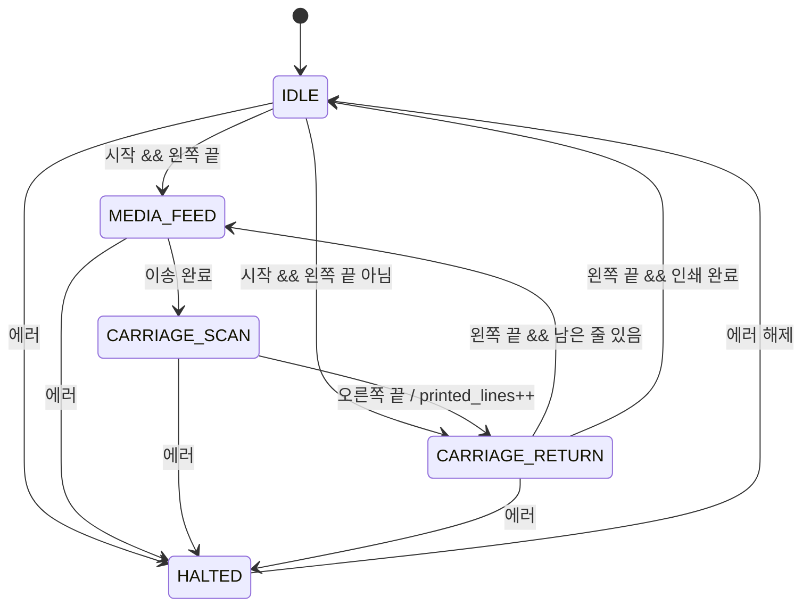

# inkjet-fw-simulator

[日本語](README.md) | [한국어](README.ko.md)

잉크젯 프린터의 캐리지 동작을 단순화해서 상정한, C 언어 펌웨어 연습용 시뮬레이터입니다.
센서 상태의 비트 플래그 관리와 캐리지 동작의 상태 전이(상태머신)를 PC 위에서 재현했습니다.

## 만든 이유

마이컴을 실제로 다뤄본 경험이 없고 C 언어도 수업에서 배운 정도였기 때문에, 펌웨어의 기본적인 사고방식을 직접 손으로 확인해 보고 싶어서 만들었습니다.
실제 기기 대신 센서 입력과 모터의 움직임을 변수로 흉내 냈습니다.

## 상태 전이도

손으로 그린 설계도는 [docs/state_diagram.pdf](docs/state_diagram.pdf)에 있습니다. 아래는 요약입니다.



| 상태 | 내용 |
|---|---|
| `ST_IDLE` | 대기. 아무것도 움직이지 않음 |
| `ST_MEDIA_FEED` | 용지를 한 줄만큼 이송 |
| `ST_CARRIAGE_SCAN` | 캐리지가 왼쪽에서 오른쪽으로 움직이며 한 줄 인쇄 |
| `ST_CARRIAGE_RETURN` | 잉크를 뿜지 않고 왼쪽 끝(원점)으로 복귀 |
| `ST_HALTED` | 에러로 인한 멈춤. 인쇄는 취소 |

## 설계 요점

### 상태, 플래그, 변수를 나누기

설계에서 가장 많이 고민한 건 정보를 세 종류로 나누는 것이었습니다.

- **상태**(`enum`): 지금 기계가 무엇을 하고 있는가
- **플래그**(비트): 센서나 버튼이 알려주는 "지금의 사실"
- **변수**(숫자): 판단에 필요한 카운터나 위치

예를 들어 "잉크 부족"은 상태가 아니라 플래그입니다. 잉크 부족이든 다른 에러든 기계의 동작은 "멈춘다"로 같기 때문에, 상태는 `ST_HALTED` 하나로 묶고 원인은 플래그로 구분했습니다.

### 비트 배치

`uint8_t flags` 1바이트에 플래그 7개를 담았습니다. 상수는 `(1u << n)` 시프트 방식으로 정의했습니다.

| bit | 플래그 | 의미 |
|---|---|---|
| 7 | (미사용) | |
| 6 | `FLAG_MEDIA_EMPTY` | 용지 없음 |
| 5 | `FLAG_INK_LOW` | 잉크 부족 |
| 4 | `FLAG_COVER_OPEN` | 커버 열림 |
| 3 | `FLAG_STOP_REQUEST` | 정지 버튼 |
| 2 | `FLAG_START_REQUEST` | 시작 버튼 |
| 1 | `FLAG_CARRIAGE_AT_LEFT` | 캐리지 왼쪽 끝 센서 |
| 0 | `FLAG_CARRIAGE_AT_RIGHT` | 캐리지 오른쪽 끝 센서 |

에러 계열 플래그는 모두 "이상하면 1"로 통일하고 위쪽 비트에 모았습니다. 그래서 처음 값 `0`이 그대로 정상 상태가 되고, `ERROR_MASK`와 AND 한 번으로 "에러가 하나라도 있는가"를 판단할 수 있습니다.

### 슈퍼 루프 구성

실제 펌웨어의 `while(1)` 루프를 상정해서, 한 바퀴를 다음 순서로 돌립니다.

```
센서 갱신(update_sensors) → 출력 → 에러 처리(handle_errors) → 상태 전이(switch) → 명령 입력
```

- **센서 흉내**: `carriage_pos`를 보고 왼쪽 끝, 오른쪽 끝 비트를 매 바퀴 켜고 끕니다. 위치를 숫자로도 갖고 있지만, 끝 판단은 센서 쪽에서 합니다. 실제 기기에서는 숫자로 센 위치가 틀어질 수 있어서, 물리적인 끝 센서가 안전장치가 되기 때문입니다.
- **에러가 최우선**: 상태 전이보다 먼저 에러를 확인하고, 에러가 있으면 `ST_HALTED`로 보냅니다. 이렇게 하면 모든 상태의 에러 전이를 한 곳에서 처리할 수 있습니다.
- **한 바퀴에 조금씩**: 캐리지를 한 번에 옮기지 않고, 한 바퀴마다 한 스텝씩만 움직입니다. 각 상태에서는 "나가는 조건을 먼저 확인하고, 아니면 그 상태의 일을 한다" 순서로 했습니다.

### 버튼 입력은 쓰고 나면 지우기

시작과 정지는 버튼이라 한 번 쓴 비트는 지웁니다. 시작 비트는 대기에서 나갈 때, 정지 비트는 멈춤에 들어갈 때 지웁니다. 안 지우면 인쇄가 끝나고 대기로 돌아오자마자 저절로 다음 인쇄가 시작됩니다.

## 빌드와 실행

```
gcc -Wall main.c -o main
main.exe
```

엔터를 칠 때마다 한 바퀴(1 tick) 진행합니다. 한 글자 명령을 입력하면 센서나 버튼 상태가 바뀝니다.

| 입력 | 동작 |
|---|---|
| 엔터 | 1 tick 진행 |
| `s` | 인쇄 시작 |
| `x` | 정지(인쇄 취소) |
| `c` | 커버 열기/닫기 |
| `i` | 잉크 부족 켜기/끄기 |
| `m` | 용지 없음 켜기/끄기 |
| `q` | 시뮬레이터 종료 |

## 동작 예시

캐리지가 움직이는 중에 커버를 열었다가, 닫은 뒤 다시 시작한 예입니다.

```
[tick   8] ST_CARRIAGE_SCAN   pos= 0 feed=5 lines=0/3  flags=00000010
c                                              ← 커버 열기
[tick   9] ST_HALTED          pos= 1 feed=5 lines=0/3  flags=00010000
[tick  10] ST_HALTED          pos= 1 feed=5 lines=0/3  flags=00010000
...                                            ← 엔터를 쳐도 멈춤 유지
c                                              ← 커버 닫기
[tick  13] ST_HALTED          pos= 1 feed=5 lines=0/3  flags=00000000
[tick  14] ST_IDLE            pos= 1 feed=5 lines=0/3  flags=00000000
[tick  15] ST_IDLE            pos= 1 feed=5 lines=0/3  flags=00000000
...
s                                              ← 시작 버튼
[tick  18] ST_IDLE            pos= 1 feed=5 lines=0/3  flags=00000100
[tick  19] ST_CARRIAGE_RETURN pos= 1 feed=5 lines=0/3  flags=00000000
[tick  20] ST_CARRIAGE_RETURN pos= 0 feed=5 lines=0/3  flags=00000010
[tick  21] ST_MEDIA_FEED      pos= 0 feed=0 lines=0/3  flags=00000010
```

- 커버를 닫아도 저절로 움직이지 않고, 시작 버튼을 기다립니다
- 캐리지가 중간(`pos=1`)에 멈춰 있었기 때문에, 먼저 원점으로 돌아간 뒤 인쇄를 시작합니다

## 개발 중 만난 문제

**플래그 상수를 "값"이라고 생각했다**
처음에는 `FLAG_INK_LOW` 자체가 0이나 1을 갖는 변수라고 생각했습니다. 실제로는 "몇 번째 비트를 볼지"를 나타내는 상수이고, 상태는 `flags`의 각 비트에 들어 있습니다. `flags & FLAG_INK_LOW`로 꺼내야 하며, "자리"와 "값"을 구분하는 게 가장 어려웠습니다.

**비트 끄는 방법**
처음에는 비트를 끄는 방법을 몰라서, `flags = flags - (flags & FLAG_START_REQUEST)`처럼 켜진 비트의 값만큼 빼는 방식을 스스로 생각해냈습니다. 동작은 했지만, `flags &= ~FLAG_START_REQUEST`라는 관용 표현을 알게 되어 읽기 쉬운 쪽으로 바꿨습니다.

**설계 단계에서 찾은 버그**
상태 전이도를 그리면서, 코드를 짜기 전에 몇 가지 문제를 찾았습니다.

- 에러로 중간에 멈춘 캐리지는 왼쪽 끝에 있지 않아서, 대기에서 영원히 출발하지 못함 → 대기에서 복귀 상태를 거쳐 가는 전이 추가
- 용지 이송 카운터를 "새 인쇄를 시작할 때"만 초기화하면 두 번째 줄부터 용지가 안 나감 → 이송으로 들어오는 모든 전이에서 초기화
- 에러 중에 눌린 시작 버튼이 남아 있으면, 에러가 풀린 뒤 저절로 인쇄가 시작됨 → 멈춤에 들어갈 때 시작 비트도 지움

**설계에 있었는데 구현에서 빠진 버그**
상태 전이도에는 "대기에서 나갈 때 시작 비트를 지운다"고 적었는데, 코드로 옮기면서 그 한 줄을 빠뜨렸습니다. 그 결과 `s`를 한 번만 눌러도 인쇄가 무한히 반복됐습니다. 로그의 `flags`에서 시작 비트가 계속 1로 남아 있는 것을 보고 원인을 찾았고, 설계도와 대조해서 고쳤습니다.

**설계도와 구현에서 바꾼 점**
상태 전이도에서는 "멈춤에 들어갈 때 한 번만" 비트를 지우는 설계였지만, 구현에서는 멈춰 있는 동안에도 매 바퀴 지우도록 했습니다. 몇 번을 실행해도 결과가 같은 처리라 해가 없고, 오히려 멈춰 있는 동안 눌린 시작 버튼도 확실히 지워져서 이쪽이 더 안전하다고 판단했습니다.

## 알려진 한계

- 단방향 인쇄만 지원
- 에러 후에는 인쇄를 취소하는 방식이라, 중단한 위치부터 재개할 수 없음
- 입력은 한 줄의 첫 글자만 해석함(대문자는 무시)
- 입력은 루프 안에서 매 바퀴 확인하는 폴링 방식
- 용지 절단은 다루지 않음
- 용지 이송 완료는 센서가 아니라 모터 스텝 수로 판단

## 앞으로의 확장

- 중단한 위치부터 인쇄를 재개하는 방식
- 양방향 인쇄와 인쇄 방향 설정 전환
- 정지 버튼을 인터럽트처럼 처리
- 전원을 켰을 때의 원점 복귀
- 상태와 변수를 구조체로 묶기, 함수 단위 테스트
