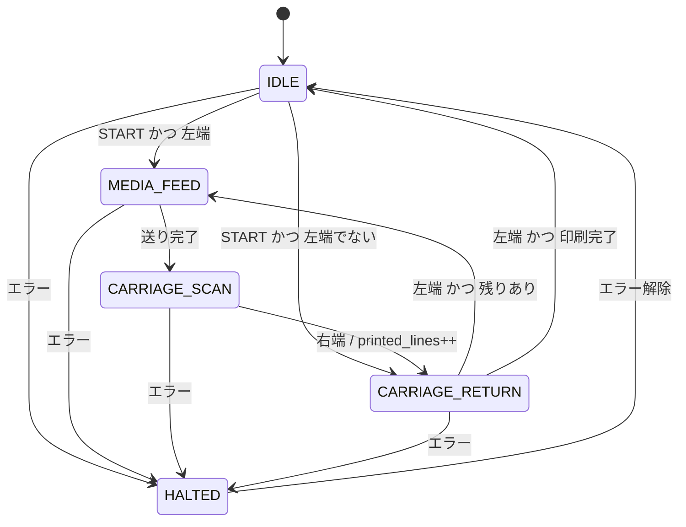

# inkjet-fw-simulator

[日本語](README.md) | [한국어](README.ko.md)

インクジェットプリンタのキャリッジ動作を単純化して想定した、C言語のファームウェア練習用シミュレータです。
センサー状態のビットフラグ管理と、キャリッジ動作の状態遷移(ステートマシン)をPC上で再現しています。

## 作った理由

マイコンを実際に扱った経験がなく、C言語も授業で学んだ程度だったため、ファームウェアの基本的な考え方を自分の手で確かめたくて作りました。
実機の代わりに、センサー入力やモーターの動きを変数で擬似的に表現しています。

## 状態遷移図

手書きの設計図は [docs/state_diagram.pdf](docs/state_diagram.pdf) にあります。以下は要約です。



| 状態 | 内容 |
|---|---|
| `ST_IDLE` | 待機。何も動かない |
| `ST_MEDIA_FEED` | 用紙を1行分送る |
| `ST_CARRIAGE_SCAN` | キャリッジが左から右へ移動しながら1行印刷 |
| `ST_CARRIAGE_RETURN` | インクを吐出せずに左端(原点)へ戻る |
| `ST_HALTED` | エラーによる停止。印刷は取り消し |

## 設計のポイント

### 状態・フラグ・変数を分ける

設計で一番考えたのは、情報を3種類に分けることでした。

- **状態**(`enum`):今、機械が何をしているか
- **フラグ**(ビット):センサーやボタンが知らせる「今の事実」
- **変数**(数値):判断に必要なカウンタや位置

たとえば「インク不足」は状態ではなくフラグです。インク不足でも他のエラーでも機械の動きは「止まる」で同じなので、状態は `ST_HALTED` ひとつにまとめ、原因はフラグで区別しています。

### ビット配置

`uint8_t flags` 1バイトに7つのフラグを入れています。定数は `(1u << n)` のシフト形式で定義しました。

| bit | フラグ | 意味 |
|---|---|---|
| 7 | (未使用) | |
| 6 | `FLAG_MEDIA_EMPTY` | 用紙なし |
| 5 | `FLAG_INK_LOW` | インク不足 |
| 4 | `FLAG_COVER_OPEN` | カバー開 |
| 3 | `FLAG_STOP_REQUEST` | 停止ボタン |
| 2 | `FLAG_START_REQUEST` | 開始ボタン |
| 1 | `FLAG_CARRIAGE_AT_LEFT` | キャリッジ左端センサー |
| 0 | `FLAG_CARRIAGE_AT_RIGHT` | キャリッジ右端センサー |

エラー系フラグはすべて「異常なら1」に統一し、上位ビットにまとめました。そのため初期値 `0` がそのまま正常状態になり、`ERROR_MASK` との AND ひとつで「エラーがひとつでもあるか」を判定できます。

### スーパーループの構成

実機ファームウェアの `while(1)` ループを想定し、1周を次の順番で回しています。

```
センサー更新(update_sensors) → 表示 → エラー処理(handle_errors) → 状態遷移(switch) → コマンド入力
```

- **センサーの擬似**:`carriage_pos` を見て左端・右端ビットを毎周期セット/クリアします。位置は数値でも持っていますが、端の判定はセンサー側で行います。実機では数値の位置がずれる可能性があり、物理的な端センサーが安全装置になるためです。
- **エラーは最優先**:状態遷移より先にエラーを確認し、エラーがあれば `ST_HALTED` へ移します。これで全状態からのエラー遷移を1か所で扱えます。
- **1周で少しずつ動く**:キャリッジを一気に動かさず、1周ごとに1ステップだけ進めます。各状態では「出る条件を先に確認し、そうでなければその状態の仕事をする」順番にしています。

### ボタン入力は使ったら消す

開始・停止はボタンなので、一度使ったビットは消しています。開始ビットは待機から出る時に、停止ビットは停止状態に入る時に消します。消さないと、印刷が終わって待機に戻った瞬間に勝手に次の印刷が始まってしまいます。

## ビルドと実行

```
gcc -Wall main.c -o main
main.exe
```

Enterを押すたびに1周(1tick)進みます。1文字のコマンドを入力するとセンサーやボタンの状態が変わります。

| 入力 | 動作 |
|---|---|
| Enter | 1tick進める |
| `s` | 印刷開始 |
| `x` | 停止(印刷取り消し) |
| `c` | カバーの開閉 |
| `i` | インク不足の切り替え |
| `m` | 用紙なしの切り替え |
| `q` | シミュレータ終了 |

## 動作例

キャリッジ移動中にカバーを開け、閉じた後に再開した例です。

```
[tick   8] ST_CARRIAGE_SCAN   pos= 0 feed=5 lines=0/3  flags=00000010
c                                              ← カバーを開ける
[tick   9] ST_HALTED          pos= 1 feed=5 lines=0/3  flags=00010000
[tick  10] ST_HALTED          pos= 1 feed=5 lines=0/3  flags=00010000
...                                            ← Enterを押しても停止のまま
c                                              ← カバーを閉じる
[tick  13] ST_HALTED          pos= 1 feed=5 lines=0/3  flags=00000000
[tick  14] ST_IDLE            pos= 1 feed=5 lines=0/3  flags=00000000
[tick  15] ST_IDLE            pos= 1 feed=5 lines=0/3  flags=00000000
...
s                                              ← 開始ボタン
[tick  18] ST_IDLE            pos= 1 feed=5 lines=0/3  flags=00000100
[tick  19] ST_CARRIAGE_RETURN pos= 1 feed=5 lines=0/3  flags=00000000
[tick  20] ST_CARRIAGE_RETURN pos= 0 feed=5 lines=0/3  flags=00000010
[tick  21] ST_MEDIA_FEED      pos= 0 feed=0 lines=0/3  flags=00000010
```

- カバーを閉じても勝手には動かず、開始ボタンを待ちます
- キャリッジが途中(`pos=1`)で止まっていたため、まず原点へ戻ってから印刷を始めます

## 開発中に直面した問題

**フラグ定数を「値」だと思っていた**
最初は `FLAG_INK_LOW` 自体が0か1の値を持つ変数だと思っていました。実際は「何番目のビットを見るか」を示す定数で、状態は `flags` の各ビットに入っています。`flags & FLAG_INK_LOW` で取り出す必要があり、「位置」と「値」の区別が一番難しかったです。

**ビットの消し方**
最初はビットの消し方を知らず、`flags = flags - (flags & FLAG_START_REQUEST)` のように、立っているビットの値を引く方法を自分で考えました。動作はしましたが、`flags &= ~FLAG_START_REQUEST` という定番の書き方を知り、読みやすい方に直しました。

**設計段階で見つけたバグ**
状態遷移図を描く中で、コードを書く前にいくつかの問題を見つけました。

- エラーで途中停止したキャリッジは左端にいないため、待機から永遠に出発できない → 待機から復帰状態を経由する遷移を追加
- 用紙送りのカウンタを「新しい印刷の開始時」だけ初期化すると、2行目以降が送られない → 用紙送りに入る全ての遷移で初期化
- エラー中に押された開始ボタンが残ると、エラー解除後に勝手に印刷が始まる → 停止状態に入る時に開始ビットも消す

**設計にあったのに実装で抜けたバグ**
状態遷移図には「待機から出る時に開始ビットを消す」と書いていましたが、コードに移す時にその1行を書き忘れました。その結果、`s` を1回押しただけで印刷が無限に繰り返されました。ログの `flags` を見ると開始ビットがずっと1のままだったことで原因に気づき、設計図と照らし合わせて修正しました。

**設計図と実装で変えた点**
状態遷移図では「停止状態に入る時に1回だけ」ビットを消す設計でしたが、実装では停止中も毎周期消すようにしました。何度実行しても結果が変わらない処理なので害がなく、むしろ停止中に押された開始ボタンも確実に消えるため、こちらの方が安全だと判断しました。

## 既知の制限

- 単方向印刷のみ
- エラー後は印刷を取り消す方式で、中断した位置からの再開はできない
- 入力は1行の先頭1文字だけを解釈する(大文字は無視)
- 入力はループ内で毎周期確認するポーリング方式
- 用紙のカットは対象外
- 用紙送りの完了はセンサーではなく、モーターのステップ数で判定

## 今後の拡張

- 中断した位置から印刷を再開する方式
- 双方向印刷と、印刷方向の設定切り替え
- 停止ボタンの割り込み風処理
- 電源投入時の原点復帰
- 状態と変数の構造体へのまとめ、関数の単体テスト
